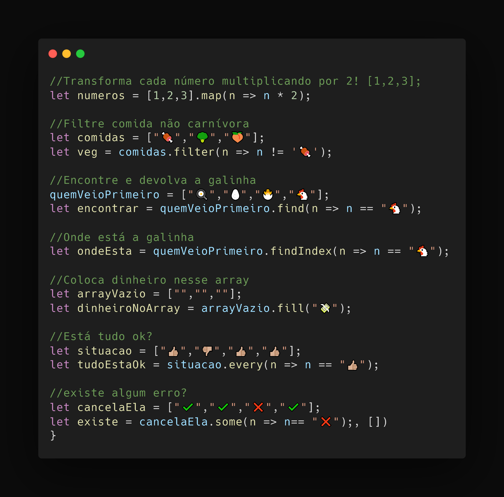

# Métodos JavaScript
> Status: Developing 🚧👷
### A ideia é deixar um repositório pra eu ter um local para consulta. Os métodos são usados para manipular, filtrar e encontrar valores em um array, futuramente vou adicionar outros métodos.
 

# Métodos usados:
+ Map() 
+ Filter()
+ Find()
+ FindIndex()
+ Every()
+ Some()
+ Fill()

# Imagem do projeto:

  

# Avisos
## Se você caiu aqui sem querer me de um feedback plz

## Link Linkedin
+ [Leonkoc](https://www.linkedin.com/in/leon-ortega-cerqueira-frontend/)